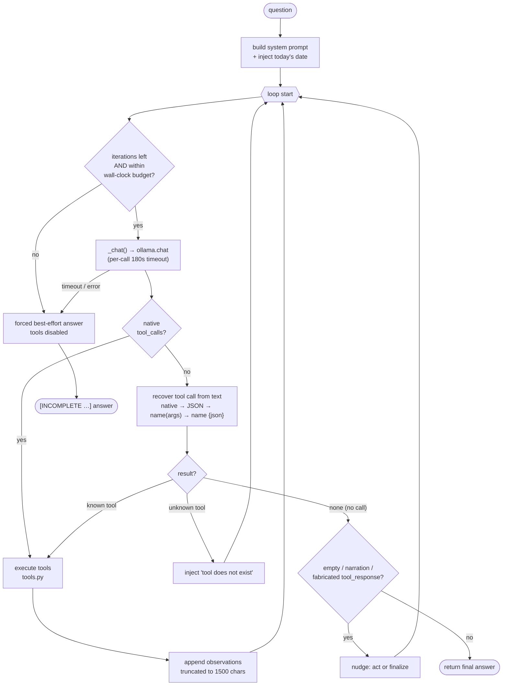
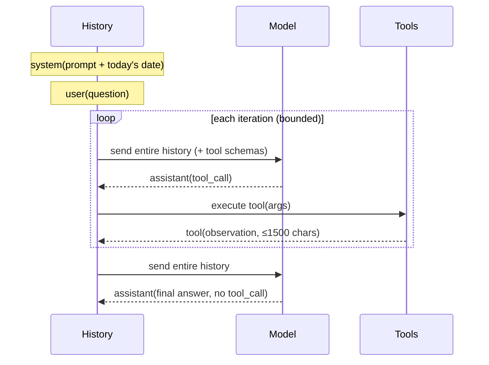

# CLI Research Agent — Technical Deep Dive

A from-scratch implementation of the **ReAct** pattern (Reason → Act → Observe)
running against a **local open-source LLM via Ollama**, with no orchestration
framework. This document explains every design decision, the failure modes
discovered while hardening it, the safeguards that resulted, and the current
measured state.

It is written to be read alongside the source: [`agent.py`](agent.py),
[`tools.py`](tools.py), [`main.py`](main.py), [`run_suite.py`](run_suite.py).

---

## 1. What this is

A command-line agent that answers complex, multi-hop questions by deciding which
tool to call, calling it, reading the result, and reasoning toward a final
answer — repeated until done. The entire agent is one loop in
`ReActAgent.run()`. Everything else (parsers, guards, prompt) is there to make
that loop survive a small, imperfect local model.

**Goal of the exercise:** understand the ReAct loop and the engineering around it
from first principles — context management, tool reliability, and the reasoning
trace — without a framework hiding any of it.

**Non-goals:** persistent memory, multi-turn chat, UI, streaming.

---

## 2. Architecture at a glance



### Files

| File | Responsibility |
|------|----------------|
| `tools.py` | The 3 tools (`web_search`, `wikipedia_lookup`, `calculator`), their function-calling **schemas**, and a name→function **registry**. |
| `agent.py` | The ReAct loop (`ReActAgent`), the system prompt, and all the text-recovery / safeguard helpers. |
| `main.py` | CLI entry point: arg parsing, UTF-8 setup, runs one question, prints the answer. |
| `run_suite.py` | Evaluation harness: runs a fixed battery of questions with full traces and a summary. |

### Message history (the agent's only memory)

The full `messages` list **is** the agent's working memory. Each iteration sends
the entire list back to the model — there is no separate scratchpad. The list
accumulates as:



Keeping that list correct and bounded is the central concern (see Decision 4 and
the safeguards).

---

## 3. The four required design decisions

The brief asked us to evaluate four decisions. Here is what we chose and why.

### Decision 1 — How does the LLM learn about the tools?

**Chosen: native function calling (Option B).** Tool schemas live in
`TOOL_SCHEMAS` (`tools.py`, OpenAI/Ollama format) and are passed to
`ollama.chat(tools=...)`. The model returns structured `tool_calls` natively.

- *Why B over A (prompt + hand-parsed JSON):* it's what production systems use,
  and it avoids the brittle "parse JSON out of free text" step as the primary
  path.
- *Reality check:* small local models are **inconsistent** at native calling —
  they frequently fall back to writing the call as text. So although B is the
  primary path, we had to build a robust **text-recovery fallback** anyway (see
  §5). In effect we learned *why* frameworks carry both: native calling is the
  happy path, text recovery is the survival path.

### Decision 2 — How to prevent infinite loops?

**Chosen: three independent ceilings, all degrading to a labelled best-effort
answer** (never a silent hang, never an empty return):

1. `max_iterations` (default 10; suite uses 15) — hard cap on tool-calling rounds.
2. `max_seconds` wall-clock budget (default 300s) — checked between iterations.
3. `_REQUEST_TIMEOUT` (180s) per individual LLM call — the only thing that can
   stop a *single* hung generation.

When any ceiling trips, the loop makes one final **tools-disabled** synthesis
call and returns `[INCOMPLETE - stopped before a confident answer]` + whatever
it could assemble. Rationale: in production an explicit, labelled partial answer
is far more useful than either an exception or `None`.

*Why three?* Each catches a different runaway (see §5, Bug 9): iterations catch
"keeps calling tools forever"; wall-clock catches "few but slow iterations";
per-call timeout catches "one generation that never returns." A real 2.5-hour
hang slipped past the first two because both only check *between* turns.

### Decision 3 — How to handle tool failures?

**Chosen: tools never raise — they return an `ERROR: ...` string** that becomes
an observation the model reads and reacts to. The dispatcher `_execute()` also
converts any unexpected exception (`TypeError` from bad args, crashes) into an
error string. The system prompt explicitly tells the model to adapt after an
error rather than give up.

This turns failures into part of the reasoning loop instead of crash points. It
is why the agent recovers when the model passes malformed calculator arguments
or a tool times out — it sees the error and tries again.

### Decision 4 — What goes into the history?

**Chosen: the full message list, with per-observation truncation.** Everything
(assistant turns + tool results) is fed back so the agent remembers what it
tried, but each tool observation is truncated to `MAX_OBSERVATION_CHARS` (1500).
Web-search results are the big offenders; 1500 chars keeps the gist without
letting context explode across many iterations. Generation per turn is
separately capped (`num_predict=512`) so the *model's* output stays short too.

---

## 4. The tools

All three are plain functions returning strings, registered in `TOOLS` and
described in `TOOL_SCHEMAS`.

### `web_search(query)`
DuckDuckGo via the `ddgs` library (import falls back to the old
`duckduckgo_search` name for version tolerance). Returns the top 3 results as
title / snippet / URL text. Network/rate-limit errors are caught and returned as
`ERROR: ...`. Used for current/real-time facts (weather, prices, "as of today").

### `wikipedia_lookup(topic)`
Hits the **official Wikipedia API directly with stdlib** (`urllib`), not the old
`wikipedia` PyPI package. Two calls: search for the best-matching page title,
then fetch that page's REST summary. A real `User-Agent` is sent because
Wikimedia now requires one.

> *Why not the `wikipedia` package?* It is from 2014 and breaks against the
> current API (returns HTML/empty → `json.loads` error). Replacing it with two
> stdlib calls removed a dependency **and** fixed the breakage.

### `calculator(expression)`
Safe arithmetic via Python's **AST**, never `eval()`. Only whitelisted operators
(`+ - * / // % **`), names (`pi`, `e`, `tau`) and functions are reachable:

```
sqrt abs round log log10 sin cos tan asin acos atan atan2
radians degrees hypot floor ceil pow
```

The trig/inverse/`radians` functions exist specifically so the model can compute
**great-circle distance** (haversine) with the three given tools — there is no
geo tool.

The signature is deliberately **lenient** (`expression=None, **kwargs`):

- Resolves the expression from alias keys (`expr`, `equation`, `input`, ...) or a
  lone string argument.
- Strips thousands separators (`1,847` → `1847`) using a digit-only regex, so
  function-argument commas (`atan2(y, x)`) survive.
- If the call is genuinely unusable, returns an **instructive** error showing the
  correct format — not a `TypeError`.

> *Why `eval()` was rejected:* even with restricted `__builtins__`, `eval`
> sandboxes are escapable and a security regression. The AST evaluator is the
> safe equivalent and was kept.

---

## 5. The reliability journey — every failure mode and its fix

This is the heart of the document. The agent was hardened across **five full
suite runs** (10 → 31 questions) on `qwen2.5:7b`. Each bug below is real,
observed in a run, and the fix is in the code today. The pattern throughout:
the loop logic was sound; almost every fix is about surviving a small model that
is *inconsistent* in how it emits tool calls and *prone to fabrication*.

| # | Failure (where seen) | Root cause | Fix | Verified |
|---|----------------------|-----------|-----|----------|
| 1 | Agent stopped at iteration 1 | Model wrote the tool call as **text** (JSON), not native `tool_calls`; loop treated text as final | `_parse_text_toolcall` recovers JSON-with-`name` from content | ✓ |
| 2 | Run ended on a hallucinated tool (`geopy`) | Recovery only matched *known* tools; unknown → treated as final | Classify unknown tool → inject "that tool doesn't exist" → continue | ✓ |
| 3 | Couldn't compute distance | No geo tool; calculator lacked inverse trig | Added `asin/atan2/radians/...`; put an **exact haversine one-liner** in the prompt | ✓ |
| 4 | Crash on `π` (U+03C0) | Windows console is cp1252 | Force UTF-8 stdout/stderr in `main.py` and `run_suite.py` | ✓ |
| 5 | Recovery failed on `6371 \* 2` | Model **markdown-escaped** chars inside JSON → invalid JSON | `_loads_lenient` strips invalid backslash escapes and retries | ✓ |
| 6 | Answer was raw `<tool_response>…` (run2 Q3) | Model **fabricated** a tool-response block in its own text | Detect `<tool_response>` → nudge to call the real tool; strip stray template tags from answers | run5: 0 leaks |
| 7 | Fabricated "24.0 °C" for a weather question (run2 Q7) | No weather tool, so the model invented `297.15-273.15` | Anti-fabrication prompt rule + "use web_search for real-time facts" | run5: Q7 now searches |
| 8 | "Days old as of April 2024" (run2 Q8) | Model used its **training cutoff** as "today" | Inject `datetime.date.today()` into the system prompt | run5: date-correct |
| 9a | One question ran **50 minutes** (run2 Q24) | Model rambled thousands of tokens on a nonsense question | `num_predict` cap (512) bounds tokens per turn | Q24 50min→88s |
| 9b | One question ran **2.5 hours** (run4 Q3) | A *single* generation crawled token-by-token; iter/wall guards only check *between* turns | `_REQUEST_TIMEOUT` (180s) on each LLM call via `ollama.Client(timeout=...)` | Q3 8875s→134s |
| 10 | Stalled on "I will search next…" / empty replies | Model narrated intent or returned nothing instead of acting | `_looks_like_narration` + empty check → **nudge** to act/finalize (bounded by iters) | ✓ |
| 11 | Answer was `web_search("…")` / `worter_lookup({…})` (run4 Q3/13/24/25) | Model wrote the call in **Python-call syntax**, which the JSON recoverer missed | `_parse_python_call` recovers whole-string `name(args)` calls | run5: 0 regressions |
| 12 | Answer was `Ronaldo_lookup {…}` (run5 Q7) | Yet another format: `name {json}` with **no parens** | Added brace-form regex `_WHOLE_CALL_BRACE_RE` | unit-tested |

### Why text-recovery is anchored to the *whole* message

`_parse_python_call` only fires when the **entire** trimmed message is a single
call (`^name(...)$` or `^name {json}$`). This is deliberate: a legitimate final
answer like *"about 1.39 furlongs (tall)"* contains parentheses, and *"the
result is {…}"* contains a brace. Anchoring to the whole string means recovery
never swallows a real answer. (Unit-tested against exactly these false-positive
cases.)

### Anti-fabrication: the highest-value behavioural fix

Several prompt rules push the model toward honesty over confident wrongness:

- **Never invent numbers** — every concrete value must come from a tool.
- **Check the premise** — if an entity doesn't exist or a fact is false, say
  `FALSE PREMISE: <reason>` and stop. (In run5 this produced correct refusals
  like "the founder of Microsoft did not discover an element" and "there is no
  mountain named after Steve Jobs.")
- **Verify each hop** before using it in the next step.
- **Search obscure unit conversions** rather than recalling them.
- **Flag ambiguity**, pick the common interpretation, say which.

These don't make a 7B model smart, but they convert a class of silent
hallucinations into either correct tool use or an honest "can't determine."

---

## 6. Safeguards catalogue

Layered defenses, from input to output:

**Loop termination (3 layers)**
- `max_iterations` — tool-round ceiling.
- `max_seconds` — wall-clock budget, checked each iteration.
- `_REQUEST_TIMEOUT` — per-LLM-call hard timeout (the only one that stops a hung
  generation).
- All three degrade to a labelled `[INCOMPLETE ...]` best-effort answer.

**Tool-call recovery (native → text → python-call → brace)**
- Native `tool_calls` (primary).
- `_parse_text_toolcall`: JSON object with a `name` + args key.
- `_parse_python_call`: whole-string `name(args)`.
- `_WHOLE_CALL_BRACE_RE`: whole-string `name {json}`.
- `_loads_lenient`: tolerates markdown-escaped JSON.
- Unknown tool name → corrective message, loop continues.

**Anti-stall**
- Empty reply, narration of intent, or fabricated `<tool_response>` → targeted
  **nudge**, never accepted as final. Bounded by `max_iterations`.

**Output hygiene**
- `_strip_tool_tags` removes stray `<tool_call>` / `<tool_response>` tags from
  final answers.

**Tool robustness (Decision 3)**
- Tools never raise; `_execute` converts every error into an `ERROR:` string.
- Calculator: AST-only (no `eval`), lenient args, comma-stripping, instructive
  errors.

**Resource / correctness**
- `MAX_OBSERVATION_CHARS` (1500) truncates tool outputs.
- `num_predict` (512) caps generation length.
- UTF-8 stdout so non-ASCII model output can't crash the CLI.
- Today's date injected so time-sensitive questions use the real "now."

---

## 7. Current state report (run 5, `qwen2.5:7b`, 31 questions)

**Health metrics:** 0 LLM-errors · 0 `<tool_response>` leaks · 0 raw tool-call
answers (the run4 regression class is gone) · all runaways bounded (slowest
question 369s vs a former 8875s) · 28 correct false-premise refusals.

**Outcome categories** (the loop behaved correctly in all 31; these describe
answer *quality*, which is now model-bound):

- **Correct / reasonable** — e.g. Q2 `2627.04`, Q8 `20,061 days` (date-correct),
  Q3 Morris Chang/TSMC (a sound hop: Apple-Silicon GPUs are TSMC-fabbed), Q4
  distance computed.
- **Correct refusals (false premise)** — Q14 (Gates discovered no element), Q15
  (no Mt. Jobs), Q24 (symbol has no orbital period), Q25 (IE is a country code).
- **Graceful incomplete** — Q10 (369s) and Q20 (330s) hit the budget and returned
  a labelled partial instead of hanging.
- **Model-capability errors (not code)** — wrong entity/number on some hops, e.g.
  Q6 picks the wrong city, Q23 moon-area math off, Q30 drifted "Tokyo"→"Toronto",
  Q21 over-refused an informal-unit question.

**The honest split:**
- **Code / loop: production-solid.** No crashes, no hangs, no format leaks,
  bounded time, graceful degradation. This is what the exercise targets.
- **Remaining wrong answers are the 7B model's reasoning ceiling**, not loop
  bugs. A larger model lifts these without any code change.

---

## 8. Configuration & tunables

In `ReActAgent.__init__` / module constants (`agent.py`):

| Knob | Default | Meaning |
|------|---------|---------|
| `model` | `llama3.1` (CLI default `qwen2.5:7b`) | Ollama model tag |
| `max_iterations` | 10 (suite 15) | tool-round ceiling |
| `max_seconds` | 300 | wall-clock budget per question |
| `_REQUEST_TIMEOUT` | 180 | per-LLM-call timeout |
| `_CHAT_OPTIONS` | `{num_predict: 512}` | max tokens generated per turn |
| `MAX_OBSERVATION_CHARS` | 1500 | tool-output truncation |

CLI (`main.py`): `--model`, `--max-iters`, `--quiet`, and `OLLAMA_MODEL` env var.

---

## 9. Hardware & model notes

Developed on a **GTX 1650 (4 GB VRAM)**, which dominates model choice:

- A model must fit in free VRAM to run fully on GPU. On 4 GB use **≤3B Q4** for
  100% GPU. `qwen2.5:3b` (~2.2 GB loaded) runs entirely on GPU and is fast but
  **weak** at follow-through (skips arithmetic, drops sub-questions).
- `qwen2.5:7b` (~4.7 GB) does **not** fully fit 4 GB → partial CPU/GPU split →
  slower, but markedly better reasoning. All hardening runs used 7b. This is the
  speed-vs-accuracy trade for this card.
- `OLLAMA_MODELS` is set to `D:\Ollama\models` (C: is space-constrained); Ollama
  reads it only at **server startup**.

A larger/better-tool-calling model (e.g. `qwen2.5:14b`, or a hosted model) would
improve answer accuracy on the multi-hop questions with **no loop changes**.

---

## 10. Known limitations & possible future work

- **Single model, single pass.** No self-consistency / voting across samples,
  which would catch the bad-hop errors (Q6/Q23/Q30 class).
- **False-premise rule is slightly aggressive** — it occasionally refuses a
  legitimate informal-unit question (run5 Q21). A softer rule risks losing the
  good refusals; this is a tuning trade-off.
- **No retry-with-backoff on transient tool/network errors** — currently the
  model adapts via the error observation, which is sufficient but not optimal.
- **Recovery parsers are heuristic.** They cover the formats observed across five
  runs; a model could invent a new malformed shape. Native calling on a stronger
  model makes recovery rarely needed.
- **No caching** of identical tool calls within a run (the model sometimes
  repeats a lookup).

---

## 11. Running it

```bash
# 1. Ollama running, with a tool-capable model pulled:
ollama pull qwen2.5:7b        # or qwen2.5:3b for full-GPU speed on 4GB

# 2. Deps:
pip install -r requirements.txt

# 3. One question:
python main.py --model qwen2.5:7b "your multi-hop question"

# 4. The evaluation battery with full traces:
python run_suite.py --model qwen2.5:7b --max-iters 15
python run_suite.py --model qwen2.5:7b --only 7      # single question
```

The reasoning trace (ITERATION / THOUGHT / ACTION / OBSERVATION / NUDGE /
FINAL) prints live — it is as important as the answer for understanding and
debugging what the agent did.
